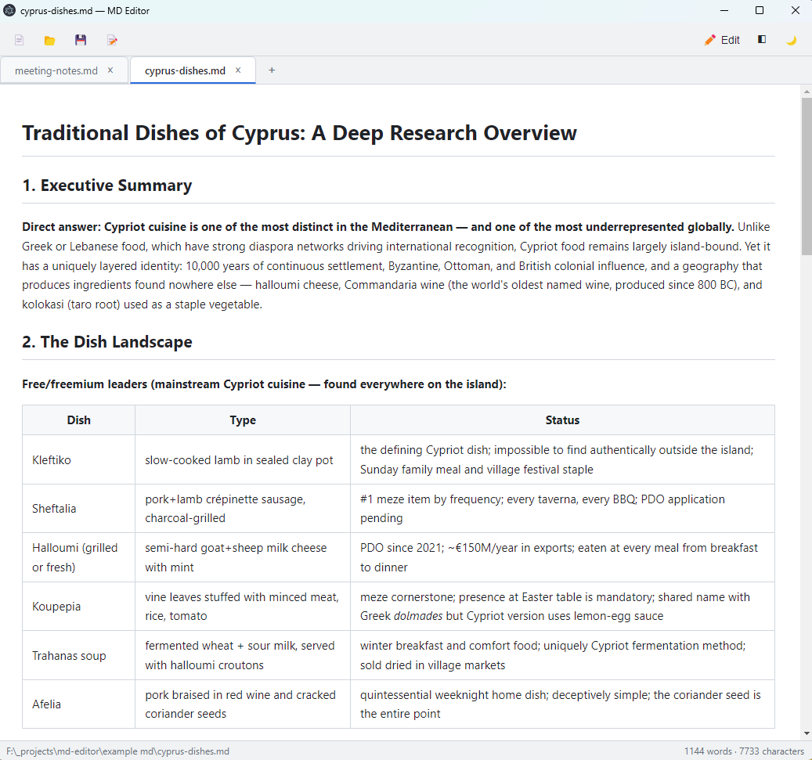
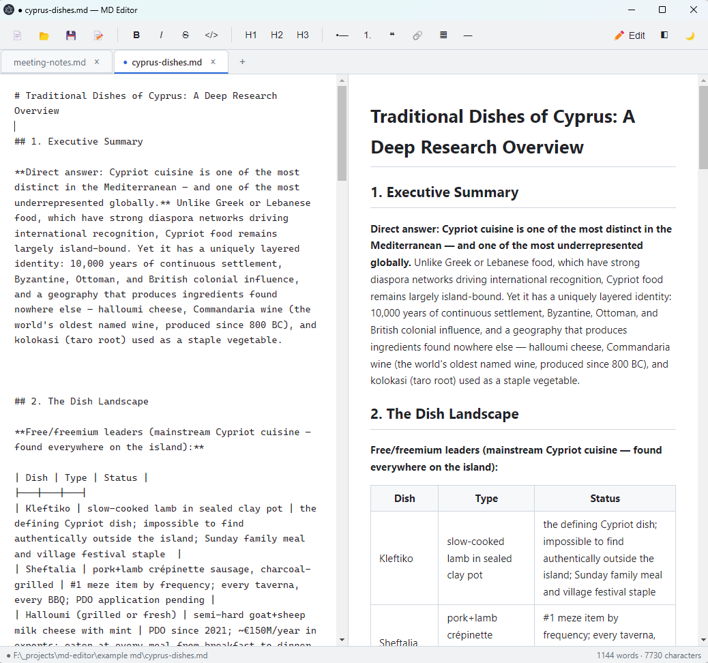
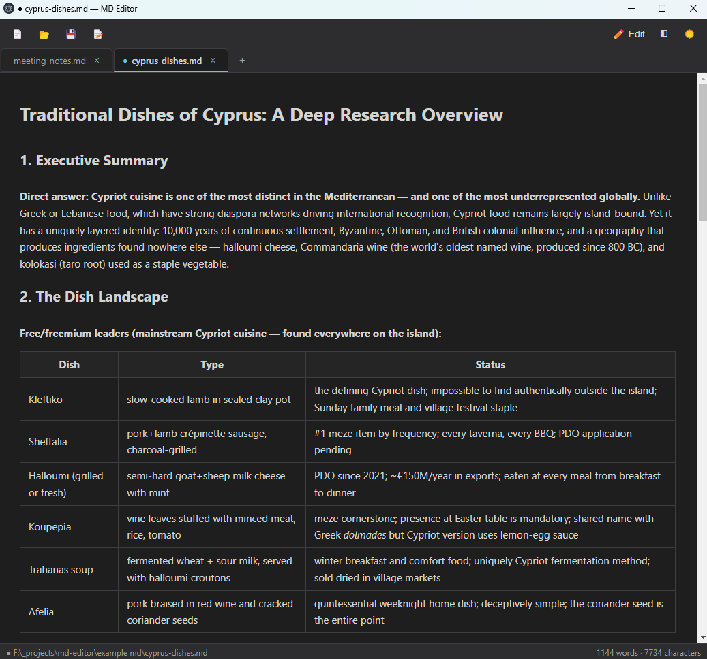

# MD Editor

A simple desktop app for reading and editing Markdown files, built with Electron.



## Download

**[Download the latest installer for Windows](https://github.com/ermellinka/md-editor/releases/latest)** — no Git or Node.js required. Grab the `.exe` from the latest release, run it, and you're set. Double-clicking any `.md` file will open it in MD Editor.

> Windows may show a SmartScreen warning because the app is not code-signed. Click "More info" -> "Run anyway".

## Features

- **Live preview** — write on the left, see the rendered result on the right, with synchronized scrolling

  
- **Tabs** — work with multiple files at once
- **Toolbar** — bold, italic, headings, lists, quotes, links, tables
- **Dark & light themes** — your choice is remembered

  
- **Open & save** `.md` files with hotkeys: Ctrl+O / Ctrl+S / Ctrl+Shift+S
- **Three view modes** — editor only / split / preview only
- **Unsaved changes protection** — warns before closing with unsaved edits
- **File association** — after installing, double-clicking a `.md` file opens it in MD Editor

## Getting started

Requires [Node.js LTS](https://nodejs.org/).

```bash
npm install
npm start
```

## Building the Windows installer

```bash
npm run dist
```

The NSIS installer (`.exe`) appears in `dist/`. After installation, `.md` files can be associated with MD Editor.

## Project structure

```
md-editor/
├── main.js          # main process: window, open/save dialogs
├── preload.js       # secure renderer ↔ main bridge (contextBridge)
├── renderer/
│   ├── index.html   # layout: toolbar, editor, preview, status bar
│   ├── style.css    # themes (CSS variables) and preview styles
│   └── app.js       # rendering (marked + DOMPurify), toolbar, themes, file handling
└── package.json
```

## Tech notes

- Markdown rendering: [marked](https://github.com/markedjs/marked), sanitized with [DOMPurify](https://github.com/cure53/DOMPurify)
- Renderer is isolated from Node.js — all file access goes through `contextBridge` in `preload.js`
- Packaged with [electron-builder](https://www.electron.build/)

## Roadmap ideas

- Syntax highlighting in code blocks (highlight.js)
- Export to HTML/PDF
- Folder file tree sidebar
- Autosave

## License

[MIT](LICENSE)
